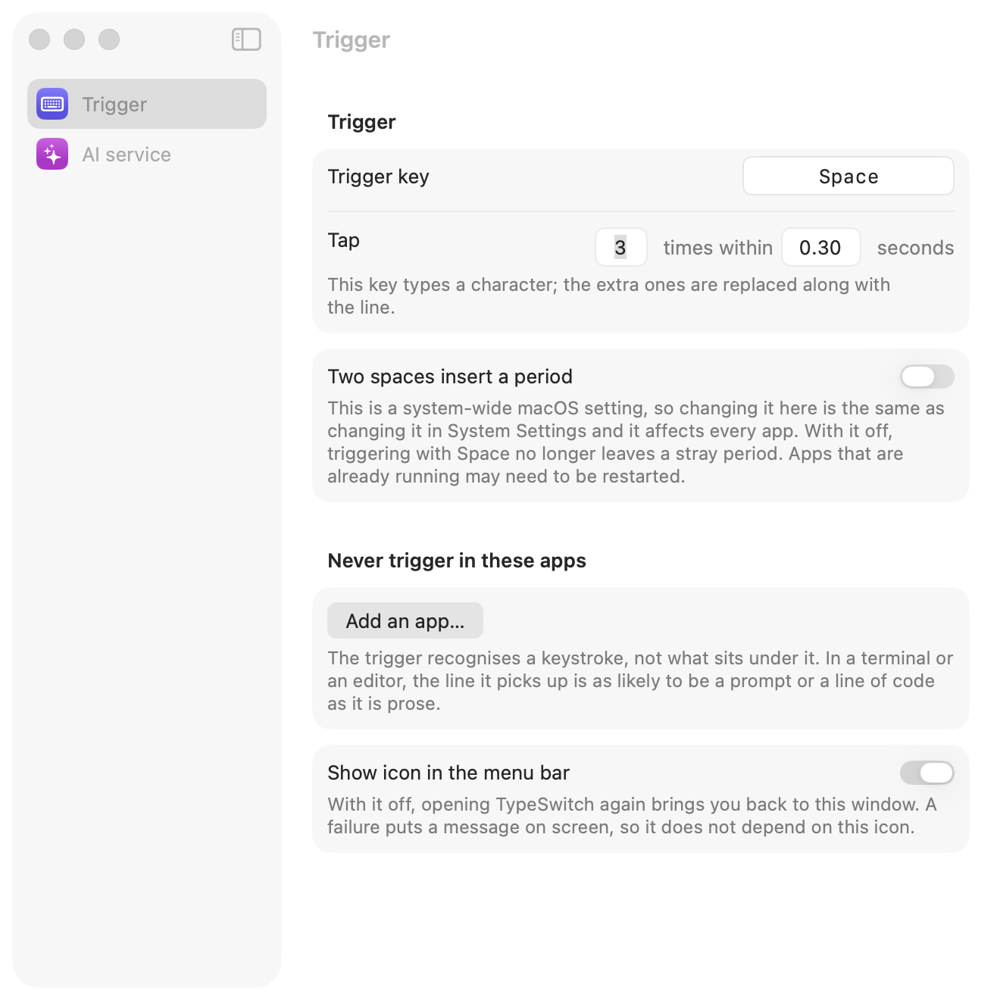

<div align="center">
  
  <h1>TypeSwitch</h1>
  <p><strong>Type the words you have. Get the language you meant.</strong></p>
  <p>
    
    
    
    
    <a href="https://github.com/max1874/type-switch/actions/workflows/ci.yml"></a>
  </p>
  <p><a href="https://github.com/max1874/type-switch/releases/latest"><strong>Download the latest DMG</strong></a> · <a href="README.zh-Hans.md">简体中文</a></p>
</div>

You are writing in one language, you hit a phrase you don't have, so you type it
in a language you do have and carry on. Tap the Space bar three times and the
line becomes the language you were writing in.

```
这个功能 should be 很简单          →  This feature should be very simple
Je voudrais 预约 une réunion       →  Je voudrais réserver une réunion
明日の会議を 预约 したい            →  明日の会議を予約したい
```

It works in any app that macOS lets it read — a text editor, a browser field, a
chat box, a terminal. The language it writes is yours to set: TypeSwitch is not
built around one language pair.

<p align="center">
  
</p>

**Read this before installing.** TypeSwitch needs Accessibility and Input
Monitoring permission, which means it can see everything you type and read the
text field you are focused on. It sends the one line it rewrites, to the endpoint
you configure, and nothing else. Read [How does it work?](#how-does-it-work) and
the source before you grant that.

## Why not just switch keyboards?

Because the interruption is the problem. Switching input method, hunting for the
word, switching back, and rereading the sentence costs more than the word was
worth. TypeSwitch lets you leave the gap in whatever language reaches your
fingers first, and repair it without breaking stride.

| Area | TypeSwitch behavior |
| --- | --- |
| What it rewrites | The selection, or the line the cursor is on |
| Target language | Whatever you type into a field, not a fixed pair |
| Where it works | Any app whose text macOS exposes, terminals included |
| Model | Your endpoint, your key, your system prompt, all editable |
| Background activity | No login item, daemon, telemetry, or analytics |
| Interface | English and Simplified Chinese, following your system |

## Requirements

- macOS 14 or later, Apple silicon or Intel
- An API key for any service that speaks the OpenAI chat-completions format
- Xcode 16 or later, only if you build it yourself

## How do I install TypeSwitch?

1. Download `TypeSwitch-<version>.dmg` and its `.sha256` from the
   [latest release](https://github.com/max1874/type-switch/releases/latest).
2. Verify the download:

   ```sh
   shasum -a 256 -c TypeSwitch-*.dmg.sha256
   ```

3. Open the DMG, drag TypeSwitch to **Applications**, and open it.

The release is signed with a Developer ID certificate and notarized by Apple, so
it opens without a Gatekeeper detour.

### Permissions

On first launch TypeSwitch asks for two grants in System Settings → Privacy &
Security:

- **Accessibility** — to read the line you are on and write the rewrite back
- **Input Monitoring** — to notice the trigger keystrokes

It only watches for the trigger and never modifies a keystroke on its way to the
app you are typing in. Grant both and it starts working; no relaunch needed.

### Your key

Open Settings → AI service, pick a provider or type any OpenAI-compatible
address, and paste your key. It is stored in your login keychain and sent only to
that address. Nothing is bundled with the app.

## Using it

Select some text and trigger, and TypeSwitch rewrites the selection. Select
nothing and it rewrites the line your cursor is on.

## Settings

**Trigger** — click the key field and press whatever key you want, then set how
many taps and how close together. The default is three taps of Space within 0.30
seconds. A modifier key (⇧, ⌘, ⌥, ⌃, left and right are distinct) types nothing,
so it leaves no stray characters in the line; an ordinary key does, and the extra
characters get replaced along with the line.

macOS turns two quick spaces into a period, which lands in the middle of a
Space-triggered rewrite. The Settings window has a switch for that system
setting, so you can turn it off without leaving the app.

**AI service** — the format, the address, the model, and your key. TypeSwitch
speaks one API format, OpenAI-compatible `POST /chat/completions`, so any
address that speaks it works; the Common addresses menu fills in DeepSeek,
OpenAI, Moonshot, or a local Ollama for you. A model running on your own
machine usually wants no key at all, so the key can be left blank.

**Output language** — what your text is rewritten *into*. Default English. Any
language the model knows works.

**Rewrite instructions** — the system prompt, shown in full and editable.
`{{language}}` is replaced with the output language above. Clear the field to go
back to the built-in one.

**Menu bar icon** — can be hidden. With it hidden, opening TypeSwitch again
brings back the Settings window.

## How does it work?

**Trigger.** A `CGEventTap` in listen-only mode counts taps of your trigger key.
Listen-only matters: a tap that swallowed the Space would break candidate
selection in every input method, so TypeSwitch never modifies the event stream.
Key repeats are filtered out, so holding the key down does not trigger it.

**Reading and writing.** The Accessibility API first — the focused element's
value and selected range. Some apps report a successful write and apply nothing,
so the write is read back to confirm; if it did not take, TypeSwitch falls back
to synthesizing ⌘C/⌘V, saving and restoring your pasteboard around it.

Because the tap does not modify events, the trigger keystrokes are still on their
way to the app when the tap fires. TypeSwitch waits for them to land before
reading, and re-reads the text at write time to confirm it has not changed. If
focus moved or the text changed, it writes nothing.

**Rewriting.** One non-streaming `POST /chat/completions`. Round-trip is about
0.6s on DeepSeek with reasoning off. The result is written back in one edit, so
⌘Z undoes it in apps that support undo.

## Build from source

```sh
git clone https://github.com/max1874/type-switch.git
cd type-switch
make app
open build/TypeSwitch.app
```

The project signs ad-hoc by default, so it builds with no Apple developer
account. The catch is that macOS ties Accessibility and Input Monitoring grants
to the signature, and an ad-hoc signature changes on every build — so you
re-approve TypeSwitch each time you rebuild. If you have a developer account,
`cp Config/Local.xcconfig.example Config/Local.xcconfig`, put your team ID in it,
and the grants stick. That file is gitignored.

```sh
make app       # Build TypeSwitch.app into build/
make install   # Move that build to /Applications and start it there
make release   # Signed, notarized, stapled DMG — maintainers only
make clean     # Remove build/
```

`build/` holds artifacts and nothing is meant to run from it: replacing a bundle
while a process is running from it leaves that process with a signature that no
longer matches its own bundle, and macOS responds by no longer recognising it —
its Accessibility and Input Monitoring grants stop applying, silently, and text
becomes unreadable everywhere. `make install` quits, replaces, and launches, in
that order, so the situation cannot arise. A build refuses to run at all if it
would overwrite a path something is running from.

`make release` runs on a maintainer's own machine rather than in CI, so the
Developer ID certificate never leaves it. It reads the notarization
credentials from `Config/notary.env`, which is gitignored; create it once from
the example and fill in the three values that come with an App Store Connect
API key:

```sh
cp Config/notary.env.example Config/notary.env
```

## Known limitations

- **It triggers on a keystroke, not on what is under it.** In a terminal or an
  editor the line it picks up may be a shell prompt or a line of code. Settings
  → Trigger takes a list of apps to ignore; it starts empty.
- **One format.** Every request goes through the same OpenAI-compatible `POST
  /chat/completions`, which has been run against DeepSeek and against
  OpenRouter. An address that speaks the format but wants something of its own
  — one more required parameter, a differently shaped error — has not been
  ruled out.
- **Undo depends on the app.** Where the pasteboard fallback is used, ⌘Z behaves
  the way a paste does in that app.

## Privacy

The text of one line, or one selection, goes to the endpoint you configured, when
you trigger it. Nothing else leaves your machine — no telemetry, no analytics, no
other network calls. Your key lives in your login keychain. The app is not
sandboxed, because a sandboxed app cannot create an event tap or read another
app's text.

## License

[PolyForm Noncommercial 1.0.0](LICENSE) © 2026 Max.

Free to use, change, and share for any noncommercial purpose — personal work,
research, teaching, charity. Commercial use needs a separate licence; open an
issue. This is source-available rather than open source: an open-source licence
cannot restrict the field of use, and this one does.
