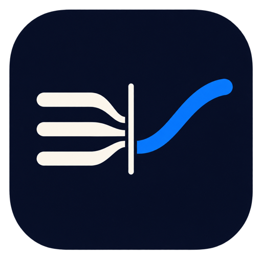

<div align="center">
  
  <h1>TypeSwitch</h1>
  <p><strong>用你想得起来的词打，得到你本来要写的语言。</strong></p>
  <p>
    
    
    
    
    <a href="https://github.com/max1874/type-switch/actions/workflows/ci.yml"></a>
  </p>
  <p><a href="https://github.com/max1874/type-switch/releases/latest"><strong>下载最新 DMG</strong></a> · <a href="README.md">English</a></p>
</div>

你在用一种语言写东西，遇到一个词想不起来，就用另一种会的语言先打上去，接着往下
写。连按三下空格，这一行就变回你本来在写的那种语言。

```
这个功能 should be 很简单          →  This feature should be very simple
Je voudrais 预约 une réunion       →  Je voudrais réserver une réunion
明日の会議を 预约 したい            →  明日の会議を予約したい
```

只要 macOS 允许读取的 app 都能用：文本编辑器、浏览器输入框、聊天框、终端。输出成
哪种语言由你自己填，TypeSwitch 不是围绕某一对固定语言做的。

**装之前请先看这段。** TypeSwitch 需要「辅助功能」和「输入监控」两项权限，也就是说
它能看到你敲的每一个键，也能读取你当前所在的输入框。它只把要改写的那一行发出去，
只发给你自己配置的接口地址，除此之外什么都不发。授权之前请先看完
[它是怎么工作的](#它是怎么工作的)，也可以直接看源码。

## 为什么不直接切输入法？

因为被打断本身才是问题。切输入法、找词、切回来、重读一遍句子，这一套的代价比那个
词本身大。TypeSwitch 让你先用最先蹦到手上的那种语言把坑留在那儿，然后不停笔地把它
补掉。

| 方面 | TypeSwitch 的行为 |
| --- | --- |
| 改写范围 | 选中的部分，或光标所在的那一行 |
| 目标语言 | 你自己填，不是固定的一对 |
| 适用范围 | 任何 macOS 暴露出文字的 app，包括终端 |
| 模型 | 你的接口、你的 Key、你的 system prompt，都能改 |
| 后台行为 | 没有登录项、没有守护进程、没有埋点、没有统计 |
| 界面语言 | 英文和简体中文，跟随系统 |

## 环境要求

- macOS 14 或更新版本，Apple 芯片或 Intel
- 任意兼容 OpenAI chat-completions 格式的服务的 API Key
- Xcode 16 或更新版本——只有自己构建时才需要

## 怎么安装 TypeSwitch？

1. 从[最新发布](https://github.com/max1874/type-switch/releases/latest)下载
   `TypeSwitch-<版本>.dmg` 和对应的 `.sha256`。
2. 校验一下：

   ```sh
   shasum -a 256 -c TypeSwitch-*.dmg.sha256
   ```

3. 打开 DMG，把 TypeSwitch 拖进「应用程序」，然后打开。

发布版用 Developer ID 证书签名并经过 Apple 公证，双击即开，不用绕 Gatekeeper。

### 权限

首次启动时，TypeSwitch 会请求「系统设置 → 隐私与安全性」下的两项权限：

- **辅助功能**——读取你所在的那一行，并把改写结果写回去
- **输入监控**——识别触发键

它只监听触发键，不会改动任何一个正在送往前台 app 的键盘事件。两项都授权后立即生
效，不需要重启。

### 你自己的 Key

打开「设置 → AI 服务」，选一个服务商，或者直接填任何兼容 OpenAI 格式的地址，然后
粘贴你的 Key。Key 存在你的登录钥匙串里，只发给你填的那个地址。App 里没有内置任何
Key。

## 怎么用

选中一段文字再触发，改写选中的部分；什么都不选，改写光标所在的那一行。

## 设置项

**触发**——点一下键位框，按你想用的那个键，再设定连按几次、间隔多久以内。默认是
0.30 秒内连按三次空格。修饰键（⇧、⌘、⌥、⌃，左右分开识别）本身不输入字符，不会在
正文里留下痕迹；普通键会输入字符，多出来的那几个会跟着整行一起被替换掉。

macOS 会把快速敲的两个空格变成句号，用空格触发时它正好夹在中间。设置窗口里直接放
了这个系统开关，不用切到系统设置去关。

**AI 服务**——接口地址、模型和你的 Key。DeepSeek、OpenAI、Moonshot、本地 Ollama
四个预设会帮你填好前两项；其他任何支持 `POST /chat/completions` 的服务，自己填地
址也能用。

**输出语言**——你的文字要被改写成哪种语言，默认 English。模型认识的语言都可以填。

**改写指令**——就是 system prompt，完整展示出来，可以直接改。其中 `{{language}}`
会被替换成上面填的输出语言。删空则恢复内置指令。

**菜单栏图标**——可以隐藏。隐藏之后，再次打开 TypeSwitch 会回到设置窗口。

## 它是怎么工作的

**触发**。用一个 listen-only 的 `CGEventTap` 数触发键被按了几次。listen-only 这点
很关键：如果为了触发而吞掉空格，所有输入法的候选词选择都会坏掉，所以 TypeSwitch
从不改动事件流。按键重复会被过滤，长按不会触发。

**读取和写回**。优先走辅助功能接口，读当前焦点元素的内容和选区。有些 app 会在写入
成功返回之后什么都不做，所以写完会再读一次确认；如果没写进去，就退回到合成 ⌘C／⌘V
的方式，并在前后保存和恢复你的剪贴板。

因为不改动事件流，触发键被数到的时候，这几下按键还在送往前台 app 的路上。
TypeSwitch 会等它们落地之后再读，写回之前还会重新读一次确认内容没变。如果焦点已经
切走，或者文字被改过，就什么都不写。

**改写**。一次非流式的 `POST /chat/completions`。DeepSeek 关掉 reasoning 之后往返
大约 0.6 秒。结果一次性写回，所以在支持撤销的 app 里 ⌘Z 能撤掉。

## 自己构建

```sh
git clone https://github.com/max1874/type-switch.git
cd type-switch
make app
open build/TypeSwitch.app
```

工程默认用 ad-hoc 签名，没有 Apple 开发者账号也能构建。代价是 macOS 把「辅助功能」
和「输入监控」的授权绑定在签名上，而 ad-hoc 签名每次构建都会变——所以每次重新构建
都要重新授权一次。如果你有开发者账号，执行
`cp Config/Local.xcconfig.example Config/Local.xcconfig`，把自己的 Team ID 填进去，
授权就能一直保留。这个文件已经在 .gitignore 里。

```sh
make app       # 构建 TypeSwitch.app 到 build/
make release   # 签名、公证、装订好的 DMG——维护者用
make clean     # 清掉 build/
```

`make release` 只在维护者自己的机器上跑，不进 CI，所以 Developer ID 证书不会离开
本机。公证凭证需要预先存一次：

```sh
xcrun notarytool store-credentials TypeSwitch \
    --key <AuthKey.p8 的路径> --key-id <key id> --issuer <issuer id>
```

## 已知限制

- **触发认的是按键，不是按键底下是什么**。终端和代码编辑器里读到的一行，可能是提
  示符或一行代码。「设置 → 触发」里可以列出不触发的 app，默认是空的。
- **只验证过 DeepSeek 这条链路**。OpenAI、Moonshot、Ollama 三个预设是按各自 API
  的公开格式写的，没有实际跑通过。
- **撤销行为取决于 app**。走剪贴板兜底路径时，⌘Z 的表现和在那个 app 里撤销一次粘
  贴一样。

## 隐私

只有你触发的那一行、或那一段选中的文字，会被发到你配置的接口地址。除此之外没有任
何数据离开你的电脑——没有埋点，没有统计，没有其他网络请求。Key 存在你的登录钥匙串
里。App 没有开启沙盒，因为沙盒环境下既不能创建事件监听，也不能读取其他 app 的文字。

## 许可

[MIT](LICENSE) © 2026 Max
